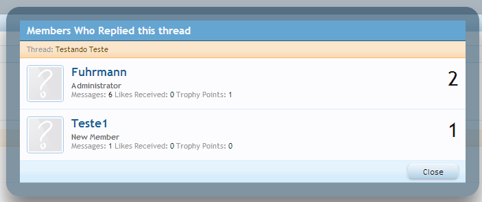

# [Who Replied](http://xenforo.com/community/resources/who-replied.1537/) - Show the users who replied to a specific thread

This is an addon for the forum software [XenForo](http://www.xenforo.com).

It will add a link to the replies number on the thread list template:


When clicking:



Permission per forum:


It was developed based on this [thread](http://xenforo.com/community/threads/view-all-the-users-who-replied-to-a-thread.46076/).

### Installation

- Download the zip file.
- Extract its contents to your hard drive.
- Upload the contents of the upload folder to the library folder of your XenForo installation.
- Complete install via the Admin CP using the provided XML file.

...or to one step install use this [this](http://xenforo.com/community/resources/add-on-install-upgrade.960/).

### Customize
If you want to customize the number of posts of each number you can add this to your extra.css

```
.whoreplied_postcount {
    font-size: 10px !important;
}
```

(this will decrease the font-size, but you can customize any way you want)

## 1.3.0
- Migrated from template hooks and post processing to Template Modification System. Catches watched threads, new posts views for free.
-  Fixed links back to thread from the Who Replied Page.

## 1.2.0
- Added a new permission under the Forum Permission Group: "View Who Replied:", this permission works per forum node
- Make use of Event Hints on Code Event listener to increase performance
- Changed template post render "find_new_threads" to "find_new_posts"

## 1.1.0
- Added a link to show all the posts from a user within the thread
- Added the same behavior of the forum thread list to the 'What's new' section

## 1.0.1
- Fixed regex problem with arabic characters

## 1.0.0
- Released
